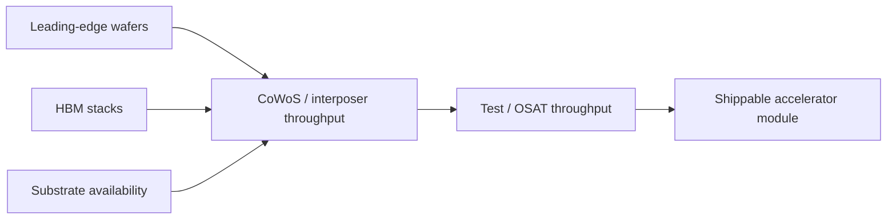
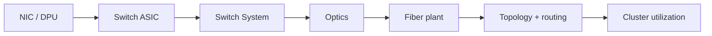
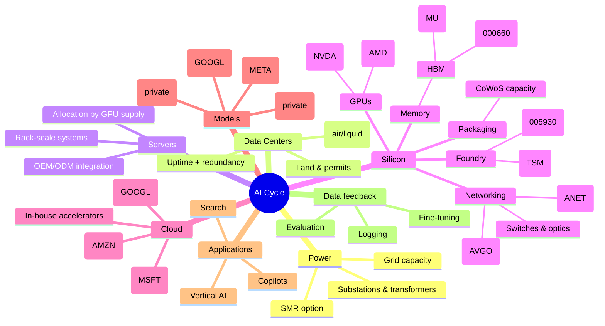
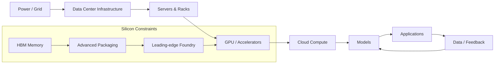

# AI Industry Framework & Dependency Map

> Goal: build a **mental + analytical model** of the AI cycle, focusing on
> **dependencies, bottlenecks, and cycle positioning**, not just company lists.

This document is intentionally **expandable**.
Each section is a scaffold we will enrich over time.

---

## 0. What We Mean by the “AI Cycle”

AI is not a flat industry. It is a **sequential, capacity‑constrained system**:

```
Electricity
→ Data Center Infrastructure
→ Servers & Racks
→ Chips (GPU / CPU / Accelerators)
→ Advanced Packaging & HBM
→ Cloud Compute
→ Models
→ Applications
→ Data Feedback
↺ (back to models)
```

If any upstream layer slows, **everything downstream is rate‑limited**.

---

## 1. Core Dependency Map (Who Depends on Whom)

### 1.1 The Hardest Dependency Chain (Non‑Negotiable)

```
HBM Memory
→ Advanced Packaging (CoWoS / interposer)
→ Leading‑edge Foundry
→ NVIDIA GPUs
→ Cloud Providers
→ AI Applications
```

This is the **most important chain** in today’s AI economy.

Key properties:
- Few suppliers
- Slow capacity expansion
- No short‑term substitutes
- Failure at any node propagates downstream

---

### 1.2 NVIDIA Dependency Breakdown

NVIDIA does **not** manufacture chips. Its real dependency structure is:

```
NVIDIA
├─ Architecture & Software (CUDA, NVLink)
├─ Foundry → TSMC (advanced nodes)
├─ Packaging → TSMC CoWoS
└─ Memory → HBM suppliers (SK hynix dominant)
```

Implication:
- NVIDIA output is capped by **packaging + HBM**, not demand
- This creates artificial scarcity even in high‑demand environments

---

### 1.3 Cloud vs NVIDIA (Strategic Dependency)

Short term:
```
Cloud Providers → NVIDIA
```

Long term (attempted):
```
Cloud Providers → In‑house accelerators (TPU / Trainium)
```

This is **not a stable dependency** but an ongoing strategic conflict.

---

### 1.4 The Often‑Ignored Constraint: Power

```
Power generation & grid
→ Substations & transformers
→ Data center build‑out
→ Compute availability
```

Reality:
- GPUs can be purchased
- Data centers cannot operate without approved power capacity
- Power & grid timelines often exceed chip timelines

---

## 2. Bottleneck vs Cyclical Companies

### 2.1 Bottleneck Companies (System Limiters)

Definition:
> Companies that **cap the industry’s maximum speed**, regardless of demand.

Characteristics:
- Very few suppliers
- Long expansion cycles (years, not quarters)
- Extremely hard to replace
- Industry must wait for them

Examples by function:

| Layer | Role |
|-----|-----|
| Leading foundry | Advanced logic manufacturing |
| Advanced packaging | GPU + HBM integration |
| HBM memory | Bandwidth ceiling |
| Lithography | Process node enablement |
| GPU ecosystem | Software + hardware lock‑in |

Mental test:
> “If this company pauses for 12 months, does the whole AI industry slow?”

If yes → bottleneck.

---

### 2.2 Cyclical / Leveraged Companies (Demand Amplifiers)

Definition:
> Companies that **benefit from AI demand but do not control it**.

Characteristics:
- Many substitutes
- Faster expansion
- Margins fluctuate with cycle
- Depend on upstream allocation

Typical categories:
- Server OEMs / ODMs
- Data center REITs
- Generic cloud services
- Most AI application companies

Mental test:
> “Can customers switch suppliers within 6–12 months?”

If yes → cyclical.

---

## 3. Power Hierarchy Summary

From strongest to weakest structural position:

1. Irreplaceable bottlenecks
2. Capacity‑constrained suppliers
3. Ecosystem owners
4. Capital‑intensive integrators
5. End‑applications

Most market narratives **over‑focus on level 5** and underweight levels 1–2.

---

## 4. Reusable Analysis Checklist

When analyzing any AI‑related company, ask:

1. What exact layer does it sit in?
2. Who are its *non‑optional* upstream dependencies?
3. Which dependency is the tightest bottleneck?
4. How long does upstream capacity take to expand?
5. Can customers realistically bypass it?

---

## 5. TODO / Expansion Hooks

Planned extensions:
- Per‑company dependency trees (NVDA / TSMC / ASML / SK hynix)
- Cycle timing: early vs late beneficiaries
- Failure scenarios (what breaks first)
- Regional risk overlays (geo / regulation)
- Mapping tickers onto dependency layers

# AI Industry Framework, Company Map, and Dependency Graph (AI Cycle)

> Goal: build a **mental + analytical model** of the AI cycle focusing on
> **dependencies, bottlenecks, and cycle positioning** — not just a list of companies.

This document is designed to be **append-only / expandable**:
- We keep the **scaffold** stable
- We keep adding **details, tickers, dependency edges, and examples**
- When we add new topics in chat, we **sync them back into this file**

> Note: “auto-update after every message” isn’t possible without an explicit sync step.
> But going forward: whenever you say “sync to md”, we will immediately update this file.

---

## Table of Contents

1. AI Cycle definition (what the “cycle” means)
2. Full stack industry map (layers + representative companies + tickers)
3. Core dependency map (who depends on whom)
4. Bottleneck vs cyclical (who limits the system vs who amplifies demand)
5. SMR (Small Modular Reactor) — why it matters for AI power
6. Mind map / dependency diagram (Mermaid)
7. [reserved]
8. Semiconductors (What they are + sub-layers + where they sit in the AI chain)
9. NAND Flash (what it is, how it differs from HBM/DRAM, and where it fits)
10. OSAT (Outsourced Semiconductor Assembly & Test) — what it is, why it matters, and example tickers

---

## 0) What We Mean by the “AI Cycle”

AI is not a flat “software industry.” It is a **sequential, capacity-constrained system**:

```
Electricity / Power
→ Data Center Infrastructure (land / permits / substations / cooling)
→ Servers & Racks (integration)
→ Silicon (GPU / CPU / accelerators + networking + memory)
→ Advanced Packaging + HBM (real supply bottlenecks)
→ Cloud Compute / Hosted clusters
→ Models (training / fine-tuning)
→ Inference deployment
→ Applications
→ Data / feedback
↺ (back to models)
```

If any upstream layer slows, **everything downstream is rate-limited**.

---

## 1) Full Stack Industry Map (Layers → Company Types → Examples + Tickers)

This section is a “classification shelf.”
Whenever you hear a company, ask: **which layer is it in?**

> Not every company is AI-native — many are “AI-enablers.”

### 1.1 Power & Energy (Electricity)

What this layer provides:
- Long-term reliable power capacity (MW / GW)
- Grid connection / interconnection approvals
- On-site backup + power quality

Representative categories:
- Power equipment (transformers, switchgear, UPS, power distribution)
- Utilities / power generation
- “Power unlock” concepts: nuclear, gas peakers, storage, microgrids

Examples (selected, non-exhaustive):
- Eaton — `NYSE:ETN` (electrical equipment / power management)
- ABB — `NYSE:ABB` (electrification + industrial automation)
- Schneider Electric — `EPA:SU` (electrical + data center power management)
- Siemens Energy — `XETRA:ENR` (power generation / grid tech)
- GE Vernova — `NYSE:GEV` (power generation + grid equipment; also tied to data center power build-out)

### 1.2 Data Center Infrastructure (Facilities)

What this layer provides:
- Space, cooling, power delivery, uptime, compliance
- Build-out timeline and capex discipline often constrain compute growth

Representative categories:
- Colocation / hyperscale data center landlords (REIT / operators)
- Cooling, racks, power delivery, facility management
- EPC / contractors for data centers (build-outs)

Examples:
- Equinix — `NASDAQ:EQIX` (colo operator)
- Digital Realty — `NYSE:DLR` (data center REIT/operator)
- Vertiv — `NYSE:VRT` (power + cooling for data centers)

### 1.3 Servers & System Integration (Turning chips into deployable clusters)

What this layer provides:
- GPU server nodes, racks, power distribution inside racks, cabling, assembly, deployment
- Often “allocated” by upstream GPU availability

Examples:
- Super Micro Computer — `NASDAQ:SMCI` (AI server / rack-scale systems)
- Dell — `NYSE:DELL` (enterprise servers)
- HPE — `NYSE:HPE` (enterprise infrastructure)
- Lenovo — `HKEX:0992` (servers)

### 1.4 Silicon (Compute, Memory, Packaging, Tools)

This is the most “dense” part of the stack.

#### 1.4.1 GPUs / Accelerators / CPUs
- NVIDIA — `NASDAQ:NVDA` (GPU + CUDA ecosystem)
- AMD — `NASDAQ:AMD` (GPU/CPU)
- Intel — `NASDAQ:INTC` (CPU + accelerators)
- Cloud in-house accelerators (not always public tickers as standalone):
  - AWS Trainium / Inferentia (Amazon — `NASDAQ:AMZN`)
  - Google TPU (Alphabet — `NASDAQ:GOOGL`)

#### 1.4.2 Foundry (manufacturing)
- TSMC — `NYSE:TSM` (leading-edge foundry)
- Samsung Electronics — `KRX:005930` (foundry + memory)


#### 1.4.3 Memory (DRAM / HBM / NAND)
- Micron — `NASDAQ:MU`
- SK hynix — `KRX:000660`
- Samsung Electronics — `KRX:005930` (also)

> For AI, HBM matters disproportionately: bandwidth + availability can cap GPU shipments.

#### 1.4.3.1 HBM Deep Dive (What it is, why it’s a hard bottleneck, who makes it)

```
**HBM (High Bandwidth Memory)** = 高带宽内存。它本质上还是 DRAM，但通过 **3D 堆叠（stacking）+ 超宽 I/O + 先进封装**，把“带宽/功耗/延迟”做到适合 GPU/加速器训练的级别。

**一句话：AI 训练不是缺容量，是缺带宽。HBM 就是把内存带宽做上去的关键部件。**

##### (A) HBM 长什么样？（直觉模型）
- 不是一条条内存条（DIMM），而是多层 DRAM die **垂直堆叠**在一起（4/8/12/16-high 等）
- 每层 die 之间用 **TSV（Through-Silicon Via）** 贯穿连接
- HBM 通常与 GPU die 一起，放在同一个封装基板/中介层上（例如 interposer），形成“GPU + HBM”的一体化封装

##### (B) 为什么 HBM 是“硬瓶颈”（Hard Bottleneck）？
HBM 之所以是硬瓶颈，不只是因为需求大，而是因为它同时卡在 **技术 + 制造 + 封装协同 + 产能节奏** 四条链上：

1) **工艺难度高（良率敏感）**
   - 多层堆叠 + TSV + 超高 I/O 意味着任何一层的缺陷都会拖累整堆良率
2) **需要先进封装协同（不是“做好内存”就完事）**
   - HBM 必须能和 GPU 封装（CoWoS/interposer 等）匹配，供货节奏要和 GPU 封装/出货同步
3) **产能扩张慢（capex + learning curve）**
   - HBM 不是普通 DRAM 线性扩产；新增产能要经过长时间爬坡
4) **供应商极度集中（寡头结构）**
   - 高端 HBM 供应集中在少数几家，任何一家交付波动都会影响整个 GPU 供应链
5) **替代性差（短期无法用 DDR/LPDDR“顶上”）**
   - 对训练/推理集群来说，HBM 带宽直接决定吞吐；用普通 DRAM 往往会让 GPU “饿死”等数据

##### (C) HBM 谁在做？（核心公司 + 产业位置）
目前 HBM 属于高度集中赛道（尤其是高端 HBM）：

- **SK hynix** — `KRX:000660`
  - 市场普遍认为其在高端 HBM（尤其 HBM3/3E）上处于领先地位
- **Samsung Electronics** — `KRX:005930`
  - DRAM/存储巨头，HBM 重要供应方之一
- **Micron** — `NASDAQ:MU`
  - HBM 参与者，扩产与良率爬坡是关注点

> 你可以把 HBM 看成“GPU 的第二张嘴”：
> GPU 算力再强，如果 HBM 带宽/供货跟不上，集群就跑不出理论性能，GPU 出货也会被限速。

##### (D) 和 HBM 强绑定的“相邻瓶颈”（顺带记住）
HBM 并不是孤立瓶颈，它通常与以下环节一起形成“复合瓶颈”：
- **先进封装产能（CoWoS/interposer）**：HBM 必须以封装形态交付到 GPU 旁边
- **封装/测试与良率**：HBM、interposer、GPU die 任一环节良率下滑都会放大为整卡短缺
- **基板/材料/设备供应链**：上游卡点会传导到 HBM 的扩产速度

```


#### 1.4.4 Advanced packaging & OSAT
- Advanced packaging is a supply bottleneck because high-end AI GPUs require complex integration
- OSAT companies exist, but the key point is the **capacity + yield + complexity** constraint

#### 1.4.4.1 Advanced Packaging Deep Dive (Why it’s a supply + performance ceiling)

Advanced packaging is where “a chip design” becomes a **shippable accelerator module**. For frontier AI GPUs, packaging is not optional — it is part of the architecture.

**Key intuition:** modern AI accelerators are limited by **(1) memory bandwidth, (2) interconnect bandwidth/latency, and (3) power/thermals**. Advanced packaging is the mechanism that makes (1) and (2) physically possible.

##### (A) What “advanced packaging” actually does
For high-end AI accelerators, packaging typically integrates:
- One (or more) large GPU/accelerator dies
- Multiple HBM stacks
- An interposer / bridge / substrate that routes extremely wide I/O
- Power delivery + signal integrity structures needed at very high bandwidth

This is why the module is often described as “GPU + HBM as one package,” not a GPU plus separate memory sticks.

##### (B) Why it becomes a **hard supply bottleneck**
Even when foundry capacity exists, shipments can be capped because packaging capacity is:
- **specialized** (not interchangeable with generic packaging)
- **yield-sensitive** (any defect in die/interposer/HBM assembly can scrap the whole module)
- **slow to expand** (equipment + know-how + multi-quarter ramp)
- **dependent on multiple upstreams** (substrates, materials, testing capacity)

Practical implication:
- You can have “enough wafers” but still be short on “finished accelerator modules.”

##### (C) Why it is also a **performance ceiling**
Packaging choices determine:
- How many HBM stacks can be placed close enough to the compute die(s)
- How wide the memory interface can be without signal integrity collapse
- Inter-die bandwidth/latency (important for multi-die architectures)
- Power delivery efficiency and thermal design limits

So packaging is not just logistics — it is part of the performance envelope.

##### (D) The “compound bottleneck”: Packaging × HBM
A useful mental model:
```
Max accelerator shipments ≈ min(Foundry wafers, Packaging capacity, HBM supply, Yield)
```

Because these constraints multiply, small yield hits can cause large supply shortfalls.

##### (E) What to watch (signals, not headlines)
When you’re tracking packaging as a constraint, the most actionable questions are:
- Are vendors expanding **advanced packaging** capacity (not just fab capacity)?
- Do you see lead times improving for interposers/substrates/testing?
- Are new designs increasing the number of HBM stacks per GPU (tightening the HBM constraint)?
- Are customers talking about “module availability” rather than “GPU demand”?

#### 1.4.4.2 Packaging + HBM Chain Breakdown (CoWoS/interposer → substrate → test/OSAT → HBM stacking/TSV)

This is the “make it shippable” chain: it turns wafers + memory dies into a finished accelerator module. The constraint is usually **capacity + yield + coordination**.

##### (A) CoWoS / Interposer (advanced packaging throughput)
What it is:
- The advanced packaging method (and related interposer/bridge structures) that places GPU die(s) and HBM stacks together with ultra-wide I/O.

Representative public exposure (tickers):
- TSMC (leading advanced packaging capacity is commonly referenced via its ecosystem) — `TSM`

Key dependency:
- Interposer/substrate supply + packaging equipment + skilled process ramp.
- Bottleneck risk: when “CoWoS capacity” is discussed, this is what people mean.

##### (B) Substrate (the hidden physical limiter)
What it is:
- The high-end package substrate that acts as the “foundation” for the module (routing, mechanical stability, signal integrity).

Public exposure:
- We have not populated dedicated substrate tickers in our table yet (we will add later).
- Treat substrate as a distinct upstream that can gate packaging output.

Key dependency:
- Specialty materials, high-precision manufacturing, qualification cycles.
- Bottleneck risk: substrate shortages can cap packaging even if CoWoS lines exist.

##### (C) Test / OSAT (assembly, test throughput, and yield)
What it is:
- Assembly/testing steps that validate the module. Yield losses here scrap expensive components.

Public exposure:
- We have not yet added OSAT tickers; they exist and matter when test capacity is tight.
- For now, model this as a capacity/yield gate within the packaging chain.

Key dependency:
- Test equipment, thermal test infrastructure, and process discipline.
- Bottleneck risk: test is the “silent limiter” because it sits at the end of the chain with the highest value-at-risk.

##### (D) HBM stacking / TSV (memory-side bottleneck mechanics)
What it is:
- Manufacturing HBM stacks (multi-die stacking + TSV + ultra-wide I/O) and delivering them in sync with packaging.

Representative public exposure (tickers):
- SK hynix — `KRX:000660`
- Samsung Electronics — `KRX:005930`
- Micron — `NASDAQ:MU`

Key dependency:
- Yields in stacking/TSV, packaging/test coordination, generation transitions (HBM3/3E and beyond).
- Bottleneck risk: per-GPU HBM requirements rising can tighten the constraint even if GPU demand is stable.

##### (E) “Who caps whom?” (dependency graph)



Key point:
- Packaging is a **convergence node**: it needs wafers + HBM + substrates at the same time.
- Test/OSAT is often the last gate; small yield hits can cause outsized shipment loss.

##### (F) Practical signals to watch (for this chain)
- “CoWoS capacity expansion” language (capacity adds, ramp timing)
- HBM allocation / qualification shifts (who is supplying what generation)
- Mentions of substrate constraints or long lead times in packaging ecosystems
- “Module availability” language vs “GPU demand” language
---

#### 1.4.5 Semiconductor equipment (tools)
- ASML — `NASDAQ:ASML` (lithography)
- Applied Materials — `NASDAQ:AMAT`
- Lam Research — `NASDAQ:LRCX`
- KLA — `NASDAQ:KLAC`


#### 1.4.6 Networking (cluster scale efficiency)
AI training is a distributed systems problem; networking is often the “silent limiter.”
- Arista — `NYSE:ANET` (data center switching)
- Cisco — `NASDAQ:CSCO`
- Broadcom — `NASDAQ:AVGO` (networking silicon / ASIC)
- Marvell — `NASDAQ:MRVL`

#### 1.4.6.1 Networking + Optics Deep Dive (Cluster scaling ceiling)

At small scale, AI looks like a GPU problem. At frontier scale, AI becomes a **distributed systems + networking** problem.

**Key intuition:** training throughput is limited by how fast GPUs can exchange gradients/activations/checkpoints. If the network can’t keep up, GPUs stall — you pay for compute that sits idle.

##### (A) What traffic dominates in large AI clusters
Common heavy flows:
- **All-reduce / collective communication** during training (gradient synchronization)
- **Activation checkpointing** and pipeline parallelism flows
- **Parameter sharding** traffic (model states spread across many GPUs)
- **Storage ↔ compute** bursts (checkpoints, dataset streaming)

This traffic is latency-sensitive (iteration time) and bandwidth-hungry (aggregate throughput).

##### (B) Why networking becomes “the ceiling”
As cluster size grows:
- Compute scales roughly with #GPUs
- Network requirements scale faster because **communication grows with parallelism**
- Congestion, tail latency, and retries compound at scale

So beyond a point, adding GPUs yields diminishing returns unless the network scales with them.

##### (C) The stack: NIC/DPU → Switch → Optics → Fiber → Topology
A typical dependency chain inside the network layer:
- **NICs / DPUs** (host interface)
- **Switch ASICs** (core forwarding capacity)
- **Switch boxes** (systems integrating ASICs)
- **Optical modules (transceivers)** converting electrical ↔ optical
- **Fiber plant** (cabling, patching, physical layout)
- **Topology** (fat-tree, leaf-spine, dragonfly, etc.)

**Why optics matters:** at these speeds/distances, copper doesn’t work; optics is mandatory, and optical module supply/qualification can become a real limiter.

##### (D) Two dominant fabrics (conceptually)
- **InfiniBand-style** (tight HPC-style fabric, historically strong for training at scale)
- **High-speed Ethernet** (rapidly evolving; appealing for standardization and cost control)

Regardless of brand/protocol, the core constraint is the same:
> if fabric bandwidth/latency doesn’t match compute scale, utilization collapses.

##### (E) What “good” looks like (practical heuristics)
- High GPU utilization at scale (not just in a single node)
- Low tail latency and stable iteration time (no “long straggler steps”)
- Network designs that avoid hotspots (topology + routing matters)
- Enough optical module supply at required speeds for cluster build-outs

##### (F) What to watch (signals)
- Mentions of “optics constraints,” “transceiver lead times,” or “switch lead times”
- Shifts from one fabric strategy to another (e.g., more Ethernet adoption or mixed fabrics)
- Cloud capex commentary about networking spend rising faster than compute spend
- New cluster builds emphasizing networking upgrades as much as GPU counts

#### 1.4.6.2 Networking Chain Breakdown (NIC/DPU → Switch ASIC → Switch System → Optics → Fiber → Topology)

This is the “inside-the-data-center fabric” chain. The key is that **cluster throughput = min(all links)**.

> In practice, build-outs often get constrained by **switch lead times**, **optics qualification**, and **topology/operations complexity**, not by “theoretical port speed.”

##### (A) NIC / DPU (host interface)
What it is:
- The card/chip that connects each server/node to the fabric (data in/out of the host).
- DPUs offload networking/storage/security tasks to reduce CPU overhead.

Representative public exposure (tickers):
- NVIDIA (InfiniBand/NVLink ecosystem pieces, plus networking products) — `NVDA`
- Broadcom (NIC silicon exposure via networking portfolio) — `AVGO`
- Marvell (networking interconnect silicon; some NIC-adjacent) — `MRVL`

Key dependency:
- Needs compatible switch fabric + optics + cabling plan.
- Bottleneck risk: less often the NIC itself; more often interoperability/driver stability at scale.

##### (B) Switch ASIC (the “brains” of the switch)
What it is:
- The forwarding silicon that defines port speed, radix, buffers, congestion behavior.

Representative public exposure (tickers):
- Broadcom (dominant merchant switch silicon for Ethernet fabrics) — `AVGO`
- Marvell (switch/DP silicon in some segments) — `MRVL`
- (Private/other ecosystems exist; public exposure is most visible via `AVGO`.)

Key dependency:
- Advanced silicon manufacturing (foundry capacity, packaging, yields).
- Bottleneck risk: can become tight if hyperscaler build-outs surge and lead times widen.

##### (C) Switch System (box-level integration)
What it is:
- The physical switch product: chassis, power, thermals, OS, optics cages, supply chain integration.

Representative public exposure (tickers):
- Arista Networks (high-performance data center switching) — `ANET`
- Cisco (broad switching portfolio; more enterprise mix) — `CSCO`

Key dependency:
- Availability of switch ASICs + optical modules + manufacturing capacity.
- Bottleneck risk: box lead times can gate cluster deployment even when GPUs are ready.

##### (D) Optics (transceivers: electrical ↔ optical)
What it is:
- Optical modules that convert electrical signals into light for high-speed links (mandatory at scale).

Representative public exposure (tickers):
- Many major optics suppliers are not in our table yet; we will add them (e.g., optical component vendors).
- For now: treat optics as a **distinct choke point** even if we don’t have the full ticker shelf populated.

Key dependency:
- Qualification at target speeds + error rates; thermal management; supply chain and testing throughput.
- Bottleneck risk: “optics lead time” is a classic scale limiter.

##### (E) Fiber plant (cabling + physical layout)
What it is:
- Fiber cables, patch panels, routing, and the physical wiring plan across racks/rows/rooms.

Public exposure:
- Typically fragmented; often not the primary public “AI trade,” but physically indispensable.

Key dependency:
- Data center build-out readiness (space/containment), labor availability for installation.
- Bottleneck risk: can delay go-live if the DC is not prepared or labor is constrained.

##### (F) Topology (how you wire the fabric)
What it is:
- The architectural layout (leaf-spine, fat-tree, dragonfly, Clos, etc.) and routing strategy.

Key dependency:
- Requires matching hardware radix/port counts + disciplined cabling + operations maturity.
- Bottleneck risk: topology errors and ops complexity create tail latency, congestion, and low utilization.

##### (G) End-to-end dependency view (why “min()” matters)



Rule of thumb:
- **If optics or switch lead times slip, cluster go-live slips** even with GPUs in hand.
- If topology/ops aren’t mature, you get **low utilization** even after go-live.

### 1.5 Cloud Compute (Compute as a Service)

What this layer provides:
- Renting compute capacity (GPU clusters) to developers and enterprises
- Managed services + deployment tooling

Examples:
- Amazon (AWS) — `NASDAQ:AMZN`
- Microsoft (Azure) — `NASDAQ:MSFT`
- Alphabet (GCP) — `NASDAQ:GOOGL`
- Oracle — `NYSE:ORCL`

### 1.6 Data Layer (storage, governance, analytics, pipelines)

What this layer provides:
- Data ingestion, warehousing, governance, pipelines
- “Feedback loop” back into training and evaluation

Examples:
- Snowflake — `NYSE:SNOW`
- MongoDB — `NASDAQ:MDB`
- Elastic — `NYSE:ESTC`
- Datadog — `NASDAQ:DDOG`

### 1.7 Model Layer (foundation models)

Categories:
- Closed / proprietary foundation models
- Open-weight ecosystems

Representative companies:
- OpenAI (private)
- Anthropic (private)
- Alphabet (Gemini) — `NASDAQ:GOOGL`
- Meta (Llama) — `NASDAQ:META`
- Microsoft (partner + distribution) — `NASDAQ:MSFT`

### 1.8 Tooling / LLMOps / MLOps (turn models into reliable systems)

Categories:
- Training pipelines, evaluation, monitoring, inference serving, orchestration
- Many are open source or private; public tickers often show up in “observability” and “data platform” companies

Examples (public exposure):
- Datadog — `NASDAQ:DDOG`
- Elastic — `NYSE:ESTC`

### 1.9 Applications (end-user value capture)

Categories:
- Productivity (copilots), customer support, search, content tools, vertical AI

Examples (broad):
- Microsoft — `NASDAQ:MSFT` (Copilot)
- Meta — `NASDAQ:META` (AI across social + ads)
- Alphabet — `NASDAQ:GOOGL` (search + assistant)

---

## 2) Core Dependency Map (Who Depends on Whom)

This is the “why” behind the cycle.

### 2.1 The Hardest Dependency Chain (Non‑Negotiable)

```
HBM Memory
→ Advanced Packaging (e.g., CoWoS/interposer capacity)
→ Leading-edge Foundry
→ NVIDIA/AMD GPUs (high-end)
→ Cloud Providers
→ AI Applications
```

Why this chain matters:
- Few suppliers at each step
- Slow capacity expansion
- Limited short-term substitutes
- A failure or delay **propagates downstream**

### 2.2 NVIDIA Dependency Breakdown (Important example)

NVIDIA does **not** manufacture chips; its actual dependency structure:

```
NVIDIA
├─ Architecture & Software (CUDA, NVLink)          [in-house moat]
├─ Foundry → TSMC (advanced nodes)                 [manufacturing dependency]
├─ Packaging → advanced packaging capacity         [shipment bottleneck]
└─ Memory → HBM suppliers (SK hynix leading)       [bandwidth + supply bottleneck]
```

Implications:
- NVIDIA output is capped by **packaging + HBM**, not demand
- “Scarcity” can exist even with strong willingness to pay

### 2.3 Cloud vs NVIDIA (Strategic dependency / ongoing game)

Short term reality:
```
Cloud Providers → NVIDIA (to sell GPU compute)
```

Long term attempt:
```
Cloud Providers → In-house accelerators (TPU / Trainium) → reduce NVDA dependency
```

This is a strategic conflict:
- Clouds want cost control + supply control
- NVIDIA wants ecosystem lock-in + pricing power

### 2.4 Power is the Often-Ignored Constraint

Hard chain:
```
Power generation & grid capacity
→ Substations & transformers
→ Data center build-out
→ Compute availability
```

Reality:
- GPUs can be purchased
- Data centers cannot run without **approved, delivered power**
- Power/grid timelines can exceed chip timelines

---

## 3) Bottleneck vs Cyclical Companies

This is the “market structure” lens.

### 3.1 Bottleneck Companies (System Limiters)

Definition:
> Companies that cap the industry’s maximum speed, regardless of demand.

Characteristics:
- Very few suppliers
- Long expansion cycles (years, not quarters)
- Extremely hard to replace
- The industry must wait for them

Examples by function:

| Layer | What makes it a bottleneck |
|---|---|
| Leading foundry | advanced manufacturing capacity is scarce |
| Advanced packaging | complex integration capacity limits GPU shipments |
| HBM memory | bandwidth + capacity limits high-end accelerators |
| Lithography | enabling tool for leading-edge nodes |
| GPU ecosystem | software + hardware lock-in creates de facto standard |

Mental test:
> “If this company pauses for 12 months, does the whole AI industry slow?”

If yes → bottleneck.

### 3.2 Cyclical / Leveraged Companies (Demand Amplifiers)

Definition:
> Companies that benefit from AI demand but do not control it.

Characteristics:
- Many substitutes
- Faster expansion
- Margins fluctuate with cycle
- Depend on upstream allocation (chips, power, customers)

Typical categories:
- Server OEMs / ODMs (often constrained by GPU allocation)
- Data center REITs/operators (dependent on tenant demand + power)
- Generic cloud services (capex cycles)
- Most AI application companies (model + distribution often substitutable)

Mental test:
> “Can customers switch suppliers within 6–12 months?”

If yes → cyclical.

---

## 4) SMR (Small Modular Reactor) — Why It Matters for AI

### 4.1 What is SMR?

SMR = **Small Modular Reactor** (小型模块化核反应堆)

Core idea:
- Split traditional nuclear plants into **smaller units** (often ~50–300 MW per module)
- Aim for **factory-style standardization**, easier deployment, modular expansion
- Target stable baseload electricity with potentially faster build timelines than conventional large plants

### 4.2 Why SMR is connected to the AI cycle

AI data centers need power that is:
- large-scale (MW-class and growing)
- stable (24/7, low interruption)
- long-term contractable (multi-decade)

In practice, many data center plans are constrained by:
- grid capacity
- interconnection approvals
- transformer/substation lead times

SMR is often discussed as a “power unlock option” because it can (in theory):
- provide reliable baseload near load centers
- reduce dependence on slow grid upgrades (depending on regulation + siting)

### 4.3 Where SMR sits in our dependency model

```
SMR (power generation option)
→ grid interconnection / substation
→ data center capacity
→ compute availability
→ AI training & inference capacity
```

### 4.4 SMR-related public companies (selected) + tickers

> Note: “SMR-related” can mean different things:
> (1) SMR designer/developer, (2) industrial firm involved in SMR programs, (3) nuclear utility benefiting from increased nuclear demand.

- NuScale Power — `NYSE:SMR` (SMR developer; most “pure-play” public exposure)
- GE Vernova — `NYSE:GEV` (energy infrastructure; associated with SMR programs and broader power build-out)
- Rolls-Royce Holdings — `LSE:RR` (UK SMR program exposure; US ADR often trades as `OTC:RYCEY`)
- Constellation Energy — `NASDAQ:CEG` (nuclear generation operator; benefits from nuclear/power demand dynamics)

### 4.5 How to classify SMR in Bottleneck vs Cyclical terms

- SMR technology (if scaled) can become a **power-layer enabler** (potential bottleneck remover)
- Nuclear utilities are often “demand transmission” beneficiaries (more cyclical / policy-driven)
- Upstream fuel (e.g., uranium) is typically more cyclical commodity exposure

## 4.6 Power Dependency Subchain: Power / SMR / Data Centers / AI Expansion Speed

This is a dedicated “power → compute” dependency chain. It explains why **AI expansion speed** can be capped by non-chip constraints.

### 4.6.1 The subchain (from electrons to usable GPUs)

```mermaid
flowchart LR
  GEN[Generation capacity<br/>(gas / nuclear / renewables)] --> GRID[Grid capacity + interconnection<br/>(permits, queue)]
  SMR[SMR option<br/>(small modular nuclear)] -.-> GEN
  GRID --> SUB[Substations + transformers<br/>(lead times)]
  SUB --> DC[Data center shells<br/>(land, permits, cooling)]
  DC --> PD[Power delivery inside DC<br/>(UPS, switchgear, busway)]
  PD --> RACK[Racks + servers + integration]
  RACK --> GPU[GPU modules available]
  GPU --> CLUSTER[Usable AI clusters<br/>(training/inference)]
  CLUSTER --> AI[AI expansion speed<br/>(capacity growth)]
```

### 4.6.2 Why power becomes the “master limiter”

Key idea:
- Chips are constrained by **HBM + packaging + foundry**
- But even if chips are available, clusters cannot run unless the **power chain** is completed

The power chain often dominates timelines because:
- Interconnection and permitting are slow (regulatory + local constraints)
- Transformers/substations have long lead times (manufacturing + backlog)
- Data center build-outs have multi-quarter lead times (civil + mechanical + cooling)
- Power delivery equipment inside the DC is also supply-chain constrained

### 4.6.3 Where the bottlenecks usually appear (practical)

Common choke points (in order of “most frequently rate-limiting”):
1) **Interconnection approval / grid upgrades** (queue + permitting)
2) **Transformers / substations** (lead times)
3) **Cooling constraints** (air vs liquid, heat rejection)
4) **Data center construction throughput** (labor, EPC capacity)
5) **On-site power delivery** (UPS/switchgear/busway availability)

### 4.6.4 Company mapping (tickers) onto the subchain

> This is not exhaustive; it’s a mapping starter for our AI cycle “power lane.”

- Power equipment / distribution: `ETN`, `SU`, `ABB`
- Grid / generation infrastructure (broad exposure): `GEV`, `ENR`
- Data center infrastructure: `VRT`, `EQIX`, `DLR`
- Cloud hyperscalers (the buyers / builders): `AMZN`, `MSFT`, `GOOGL`, `ORCL`
- SMR (optionality): `SMR`, `RR` / `RYCEY`
- Nuclear utility exposure: `CEG`

### 4.6.5 The key metric: MW delivered, not MW announced

When tracking AI expansion speed, prioritize:
- **MW delivered / energized** (actually usable)
- Interconnection queue progress (approvals vs applications)
- Transformer/substation lead times (months-to-delivery)
- PUE and cooling constraints (design shifts to liquid)
- “Time to power” for new data center capacity

A simple mental model:
> “AI capacity growth rate ≈ min(GPU modules, network/optics, **delivered MW**).”

## 5) Mind Map / Diagram (Mermaid)

### 5.1 Mind map (conceptual)



### 5.2 Dependency flowchart (who depends on whom)



---

## 6) Reusable Analysis Checklist (Quick mental model)

When analyzing any AI-related company, ask:

1) Which exact layer does it sit in?
2) What are its **non-optional** upstream dependencies?
3) Which dependency is the tightest bottleneck?
4) How long does upstream capacity take to expand (quarters vs years)?
5) Can customers realistically bypass it (switching cost, compatibility, regulation)?
6) Is it a bottleneck (system limiter) or cyclical (demand amplifier)?

---

## 7) Master Table: Ticker × Layer × Bottleneck/Cyclical

Legend (how we classify):
- **Bottleneck**: caps the industry’s max speed; few substitutes; slow to expand; the ecosystem must wait.
- **Cyclical**: benefits from AI demand but does not control the pace; more substitutes; margins/capex are cycle-sensitive.
- **Hybrid**: has both bottleneck-like and cyclical traits (often “capacity-constrained suppliers” or firms spanning multiple layers).

> Tip: if customers can realistically switch suppliers within **6–12 months**, it tends to be **Cyclical**.
> If the whole industry slows when it pauses for **12 months**, it tends to be **Bottleneck**.

| Company | Ticker | Exchange | Layer | Sub-layer | Role (1-liner) | Class (Bottleneck/Cyclical/Hybrid) | Critical dependencies (what it needs) | Who depends on it (downstream) |
|---|---|---|---|---|---|---|---|---|
| Eaton | ETN | NYSE | Power & Energy | Power management equipment | UPS/power distribution enabling data center reliability | Hybrid | Grid build-out cycles; components supply | Data centers, server racks |
| ABB | ABB | NYSE | Power & Energy | Electrification & automation | Electrification + industrial control for power/infra | Cyclical | Industrial capex; project pipeline | Data centers, utilities, industrial sites |
| Schneider Electric | SU | EPA | Power & Energy | Electrical + DC power systems | Power distribution, controls, DC management | Hybrid | Electrical component supply; construction cycles | Data centers, utilities, enterprises |
| Siemens Energy | ENR | XETRA | Power & Energy | Generation + grid tech | Grid and generation equipment supporting capacity growth | Cyclical | Energy capex, regulation, project timing | Utilities, large power users |
| GE Vernova | GEV | NYSE | Power & Energy | Generation + grid equipment | Generation/grid build-out (incl. nuclear-adjacent programs) | Hybrid | Project execution; supply chain; policy | Utilities, data centers indirectly |
| Equinix | EQIX | NASDAQ | Data Centers | Colocation operator | Sells space/power/cooling/uptime to tenants | Cyclical | Power availability; capex; tenant demand | Enterprises, cloud, AI tenants |
| Digital Realty | DLR | NYSE | Data Centers | REIT/operator | Data center capacity landlord/operator | Cyclical | Power availability; financing rates; build timelines | Enterprises, cloud, AI tenants |
| Vertiv | VRT | NYSE | Data Centers | Cooling + power delivery | Critical cooling/power gear for high-density racks | Hybrid | Component supply; data center capex | Data centers, server integrators |
| Super Micro Computer | SMCI | NASDAQ | Servers | Rack-scale integration | Integrates GPU servers/racks for deployment | Cyclical | GPU allocation; power/cooling specs | Cloud/enterprise buyers |
| Dell Technologies | DELL | NYSE | Servers | Enterprise servers | Builds enterprise AI server solutions | Cyclical | GPU/CPU supply; enterprise IT budgets | Enterprises, AI deployments |
| HPE | HPE | NYSE | Servers | Enterprise infrastructure | On-prem/enterprise AI infra + services | Cyclical | Enterprise capex; hardware supply | Enterprises, public sector |
| Lenovo | 0992 | HKEX | Servers | Enterprise servers | Server OEM with global channel | Cyclical | Component supply; global demand | Enterprises |
| NVIDIA | NVDA | NASDAQ | Silicon | GPUs + ecosystem | Dominant AI GPU + CUDA stack | Bottleneck | TSMC leading-edge + packaging; HBM supply | Clouds, server OEMs, model builders |
| AMD | AMD | NASDAQ | Silicon | GPUs/CPUs | Alternative accelerator + CPU supplier | Cyclical | TSMC capacity; ecosystem adoption | Clouds, enterprises (as alternative) |
| Intel | INTC | NASDAQ | Silicon | CPUs + accelerators | CPU platform + accelerator attempts | Cyclical | Process execution; platform adoption | Enterprises, PC/server ecosystem |
| TSMC | TSM | NYSE | Silicon | Foundry | Leading-edge manufacturing + advanced packaging capacity | Bottleneck | Equipment (EUV), materials, energy/water | NVIDIA/AMD, entire advanced silicon stack |
| Samsung Electronics | 005930 | KRX | Silicon | Memory + foundry | Major memory supplier; foundry participant | Hybrid | Capex, yield/ramp execution | Device OEMs, data center buyers |
| Micron | MU | NASDAQ | Silicon | Memory (HBM/DRAM/NAND) | Memory supplier; HBM participation | Hybrid | Manufacturing yields; capex; materials | GPU vendors, server makers |
| SK hynix | 000660 | KRX | Silicon | Memory (HBM) | Leading HBM supplier (AI bandwidth enabler) | Bottleneck | Advanced packaging/test; capex | NVIDIA/AMD supply chain, AI clusters |
| ASML | ASML | NASDAQ | Silicon Tools | Lithography | EUV/DUV lithography enabling leading nodes | Bottleneck | Precision supply chain; export controls | TSMC/Samsung/Intel foundries |
| Applied Materials | AMAT | NASDAQ | Silicon Tools | Deposition/etch equipment | Core process tools for fab capacity expansion | Hybrid | Semi capex cycles; component supply | Foundries, memory makers |
| Lam Research | LRCX | NASDAQ | Silicon Tools | Etch/deposition | Process tools for leading-edge and memory | Hybrid | Semi capex cycles | Foundries, memory makers |
| KLA | KLAC | NASDAQ | Silicon Tools | Metrology/inspection | Yield/quality tools limiting ramp speed | Hybrid | Semi capex cycles | Foundries, memory makers |
| Arista Networks | ANET | NYSE | Networking | Data center switching | High-performance switches for AI clusters | Hybrid | Cloud capex; silicon supply | Data centers, cloud AI clusters |
| Cisco | CSCO | NASDAQ | Networking | Routing/switching | Broad networking vendor, enterprise-heavy | Cyclical | Enterprise IT spend | Enterprises, some DC buyers |
| Broadcom | AVGO | NASDAQ | Networking | ASIC + networking silicon | Networking silicon/ASICs critical to DC scale | Hybrid | Foundry capacity; design wins | Switch vendors, cloud infra |
| Marvell | MRVL | NASDAQ | Networking | Networking silicon | Interconnect/storage/network silicon for DC | Cyclical | Design wins; foundry capacity | Cloud/enterprise infra |
| Amazon (AWS) | AMZN | NASDAQ | Cloud Compute | Hyperscaler | Sells GPU compute + builds in-house accelerators | Hybrid | GPU supply; power; data center build | Developers, enterprises, model builders |
| Microsoft (Azure) | MSFT | NASDAQ | Cloud Compute | Hyperscaler | Cloud compute + model distribution (Copilots) | Hybrid | GPU supply; power; model partnerships | Enterprises, consumers, developers |
| Alphabet (GCP) | GOOGL | NASDAQ | Cloud/Models | Hyperscaler + TPU | Cloud + TPU + Gemini ecosystem | Hybrid | Data center power; TPU supply chain | Developers, enterprises, consumers |
| Oracle | ORCL | NYSE | Cloud Compute | Cloud provider | Cloud infra + enterprise software distribution | Cyclical | Capex cycles; customer adoption | Enterprises |
| Snowflake | SNOW | NYSE | Data Layer | Data platform | Data warehousing/governance for AI pipelines | Cyclical | Cloud infra; enterprise data adoption | Enterprises building AI apps |
| MongoDB | MDB | NASDAQ | Data Layer | Database | Operational DB often used in AI apps | Cyclical | Developer adoption; cloud infra | App developers/enterprises |
| Elastic | ESTC | NYSE | Data Layer | Search/logging | Search + observability (data feedback loop) | Cyclical | Cloud spend; adoption | App teams, AI ops |
| Datadog | DDOG | NASDAQ | Tooling | Observability | Monitoring for production AI systems | Cyclical | Cloud adoption; enterprise spend | DevOps/LLMOps teams |
| Meta Platforms | META | NASDAQ | Models/Apps | Social + open-weight models | Llama ecosystem + AI-driven ads/products | Hybrid | GPU supply; user demand; regulation | Developers (open models), advertisers/users |
| NuScale Power | SMR | NYSE | Power & Energy | SMR developer | SMR “pure-play” public exposure | Cyclical | Regulation; financing; project execution | Potentially data centers/industrial users |
| Rolls-Royce Holdings | RR | LSE | Power & Energy | SMR program exposure | UK SMR program + industrial capability | Cyclical | Government programs; approvals | Potential future power customers |
| Rolls-Royce ADR | RYCEY | OTC | Power & Energy | SMR program exposure | US ADR for Rolls-Royce | Cyclical | Same as RR | Same as RR |
| Constellation Energy | CEG | NASDAQ | Power & Energy | Nuclear utility | Nuclear generation operator; power demand beneficiary | Cyclical | Regulation; fuel; grid markets | Data center buyers indirectly |
| Tempus AI | TEM | NASDAQ | Applications | Healthcare AI / diagnostics | AI-driven precision medicine, genomics, clinical decision support | Cyclical | Cloud compute, data access, regulatory approval | Hospitals, pharma, healthcare systems |
| Iris Energy | IREN | NASDAQ | Power & Energy | Data center power + mining/AI infra | Power-backed compute sites (historically mining, pivoting to AI/HPC) | Cyclical | Power contracts, grid interconnection, capex | AI/HPC tenants, miners |
| Nebius Group | NBIS | NASDAQ | Cloud / Data Centers | AI-focused cloud + infra | GPU cloud & AI infrastructure spin-out | Cyclical | GPU allocation, power availability, DC build-out | AI startups, enterprises |
| SanDisk | SNDK | NASDAQ | Data Layer | NAND flash / storage | NAND-based storage for data, checkpoints, enterprise SSDs | Cyclical | Memory cycle, capex, manufacturing yields | Data centers, enterprises |

This table is a living index; we will keep expanding it.


## 8) Bottleneck Profiles (Ticker + Dependencies)

### 8.1 NVIDIA — `NASDAQ:NVDA`

- **Layer / Class**: Silicon → GPU + Ecosystem | **Bottleneck**
- **What it sells**: High-end AI GPUs (H100, H200, B100, etc.), CUDA software stack, InfiniBand networking, system reference designs.
- **Key dependencies**
  - Leading-edge foundry (TSMC, advanced nodes)
  - Advanced packaging (CoWoS/interposer, substrate, test)
  - HBM memory (SK hynix, Samsung, Micron)
  - Power delivery and system integration (OEM partners)
- **Why it’s a bottleneck**
  - Dominant market share in training/inference accelerators
  - CUDA ecosystem lock-in (software, developer tooling)
  - Downstream clouds, hyperscalers, and model labs depend on allocation
  - Output is capped by packaging + HBM, not demand
- **Cycle behavior**
  - Early-cycle beneficiary (constrains entire downstream build-out)
  - Scarcity premium in allocation-constrained phases

---

### 8.2 TSMC — `NYSE:TSM`

- **Layer / Class**: Silicon → Foundry + Advanced Packaging | **Bottleneck**
- **What it sells**: Leading-node wafer fabrication (N5, N4, N3, etc.), advanced packaging (CoWoS, SoIC, interposer), backend/test.
- **Key dependencies**
  - ASML (EUV/DUV lithography equipment)
  - Materials, specialty gases, substrate supply
  - Power and water supply (local infrastructure)
  - Skilled labor and process know-how
- **Why it’s a bottleneck**
  - Only source for leading-edge logic at required scale/yield
  - Advanced packaging capacity is rate-limiting for AI GPUs
  - Any disruption propagates through the entire AI supply chain
- **Cycle behavior**
  - Early-cycle bottleneck; sets pace for all advanced silicon launches
  - Capacity expansions are multi-year, not multi-quarter

---

### 8.3 ASML — `NASDAQ:ASML`

- **Layer / Class**: Silicon Tools → Lithography | **Bottleneck**
- **What it sells**: EUV and DUV lithography systems (enabling advanced process nodes).
- **Key dependencies**
  - Precision optics (Zeiss, specialty suppliers)
  - High-purity materials, extreme supply chain coordination
  - Export controls (geopolitics, regulatory risk)
- **Why it’s a bottleneck**
  - Only supplier of EUV systems (required for N7/N5/N3 and below)
  - Lead times are long; few units shipped per year
  - All leading-edge foundries (TSMC, Samsung, Intel) depend on ASML tool delivery
- **Cycle behavior**
  - Bottleneck at the root of the advanced node ramp
  - Delays or export shocks ripple through global AI hardware supply

---

### 8.4 SK hynix — `KRX:000660`

- **Layer / Class**: Silicon → Memory (HBM) | **Bottleneck**
- **What it sells**: High Bandwidth Memory (HBM2E, HBM3, HBM3E), DRAM products for AI accelerators.
- **Key dependencies**
  - Advanced DRAM process technology
  - TSV (through-silicon via) stacking, yield management
  - Packaging/test coordination with GPU vendors and OSATs
  - Upstream materials, capex for expansion
- **Why it’s a bottleneck**
  - HBM is the bandwidth ceiling for AI GPUs; supply/delivery caps accelerator shipments
  - SK hynix is widely regarded as the leader in high-end HBM (esp. HBM3/3E)
  - Any yield or ramp issue immediately constrains NVIDIA/AMD output
- **Cycle behavior**
  - Early and persistent bottleneck; HBM allocation is a gating factor for downstream
  - Expansion cycles are slow, with years-long learning curves for new generations

---

### 8.5 Selected Cyclical Profiles (TEM / IREN / NBIS / SNDK)

```
These companies are frequently discussed alongside AI narratives but occupy **non-bottleneck, cyclical positions** in the AI cycle. They benefit from AI expansion but do not set the industry’s speed limit.

---

#### Tempus AI — `TEM`

- **Layer / Class**: Applications → Vertical AI (Healthcare) | **Cyclical**
- **What it sells**: AI-driven clinical decision support, genomics analytics, and precision medicine platforms.
- **Key dependencies**
  - Cloud compute (GPU access via hyperscalers)
  - Data access (clinical + genomic datasets)
  - Regulatory approval and healthcare adoption cycles
- **Why it’s not a bottleneck**
  - Compute and models are substitutable
  - Value capture depends on adoption and reimbursement, not infrastructure scarcity
- **Cycle behavior**
  - Benefits late in the cycle when AI adoption translates into vertical-specific ROI
  - Sensitive to sentiment and revenue execution

---

#### Iris Energy — `IREN`

- **Layer / Class**: Power & Energy → Power-backed compute sites | **Cyclical**
- **What it sells**: Low-cost power sites historically used for mining, now marketed toward AI/HPC workloads.
- **Key dependencies**
  - Grid interconnection and power contracts
  - Capital availability for site conversion and build-out
  - Demand from AI/HPC tenants
- **Why it’s not a bottleneck**
  - Power is necessary but not exclusive; sites compete with other power/data center locations
  - Expansion speed depends on permitting and financing, not unique technology
- **Cycle behavior**
  - Strong beta to AI power narratives
  - High drawdown risk if AI demand slows or power monetization lags

---

#### Nebius Group — `NBIS`

- **Layer / Class**: Cloud / Data Centers → AI infrastructure | **Cyclical**
- **What it sells**: GPU cloud capacity and AI-focused infrastructure services.
- **Key dependencies**
  - GPU allocation (primarily from `NVDA`)
  - Power availability and data center build timelines
  - Network connectivity and optics
- **Why it’s not a bottleneck**
  - Competes with hyperscalers and other GPU cloud providers
  - No proprietary constraint removal (depends on upstream supply)
- **Cycle behavior**
  - Moves strongly in Phase 1–2 narrative expansions
  - Vulnerable to pricing pressure and GPU normalization

---

#### SanDisk — `SNDK`

- **Layer / Class**: Data Layer → Storage (NAND Flash) | **Cyclical**
- **What it sells**: NAND flash and SSD storage for enterprise and data center use.
- **Key dependencies**
  - Memory pricing cycle
  - Manufacturing yields and capex discipline
- **Why it’s not a bottleneck**
  - NAND is widely supplied and substitutable
  - AI does not materially depend on NAND throughput for training performance
- **Cycle behavior**
  - Participates via incremental data/storage demand
  - Historically high volatility with memory cycles
```

## 9) Layer × Ticker Matrix (B/C labels)

| Layer                         | Bottleneck Companies (B)         | Ticker(s)          | Cyclical/Leveraged Companies (C) | Ticker(s)         |
|-------------------------------|----------------------------------|--------------------|----------------------------------|-------------------|
| Power & Energy                | (None are true bottlenecks yet)  | —                  | Eaton, ABB, Schneider, Siemens, GE Vernova, Constellation, Rolls-Royce, NuScale, Iris Energy | ETN, ABB, SU, ENR, GEV, CEG, RR/RYCEY, SMR, IREN |
| Data Center Infrastructure    | (None are true bottlenecks yet)  | —                  | Equinix, Digital Realty, Vertiv  | EQIX, DLR, VRT    |
| Servers & Integration         | (None are true bottlenecks)      | —                  | Super Micro, Dell, HPE, Lenovo   | SMCI, DELL, HPE, 0992 |
| Silicon: GPU + Ecosystem      | NVIDIA                           | NVDA               | AMD, Intel                      | AMD, INTC         |
| Silicon: Foundry              | TSMC                             | TSM                | Samsung (partial), Intel         | 005930, INTC      |
| Silicon: Packaging            | TSMC (CoWoS)                     | TSM                | ASE (private/less public)        | —                 |
| Silicon: HBM Memory           | SK hynix                         | 000660             | Samsung, Micron                  | 005930, MU        |
| Silicon: Lithography Tools    | ASML                             | ASML               | Applied Materials, Lam, KLA      | AMAT, LRCX, KLAC  |
| Silicon: Networking Silicon   | (None are sole bottlenecks)      | —                  | Broadcom, Marvell                | AVGO, MRVL        |
| Networking: Switch Systems    | (None are sole bottlenecks)      | —                  | Arista, Cisco                    | ANET, CSCO        |
| Networking: Optics/Modules    | (Not fully public mapped)        | —                  | (To add: LITE, ACIA, etc.)       | —                 |
| Cloud Compute                 | (None are sole bottlenecks)      | —                  | Amazon, Microsoft, Alphabet, Oracle, Nebius | AMZN, MSFT, GOOGL, ORCL, NBIS |
| Data Layer                    | (None are bottlenecks)           | —                  | Snowflake, MongoDB, Elastic      | SNOW, MDB, ESTC   |
| Model Layer                   | (None are bottlenecks)           | —                  | Meta, Alphabet, Microsoft, OpenAI, Anthropic | META, GOOGL, MSFT |
| Tooling / Observability       | (None are bottlenecks)           | —                  | Datadog, Elastic                 | DDOG, ESTC        |
| Applications                  | (None are bottlenecks)           | —                  | Tempus AI, Meta, Microsoft       | TEM, META, MSFT   |

**Legend:**
B = Bottleneck (caps cycle speed, few substitutes, slow to expand)
C = Cyclical / Leveraged (benefits from demand, does not cap system speed)

**Notes:**
- Some companies (Samsung, Micron, Meta, etc.) have hybrid roles; they may be bottleneck-like in one subsegment and cyclical in another.
- “Packaging” bottleneck is currently most visible at TSMC (CoWoS), but OSATs may become more important in future expansion.
- Optics (transceivers/modules) is an emerging bottleneck at scale, but public exposure is limited.
- This table is a living document and will be expanded as more tickers and dependencies are mapped.

---

## 10) AI Cycle Stage Lens (who leads, who lags, who retraces)

### 10.1 Stage 1: Bottleneck Expansion (Cycle Leaders)
- **Who leads:** Bottleneck companies at the root of the supply chain (NVIDIA, TSMC, SK hynix, ASML)
- **What happens:** Scarcity pricing, allocation games, “who gets supply” is the main narrative. Downstream companies are capped by upstream delivery.
- **Implication:** Early-cycle alpha is concentrated in bottleneck tickers. Leverage is highest here, but so is drawdown risk if bottlenecks ease.

### 10.2 Stage 2: Downstream Leverage (Cycle Broadening)
- **Who leads:** Cyclical/leveraged companies directly downstream (server OEMs, data center builders, cloud compute, networking)
- **What happens:** As bottleneck supply expands, downstream companies see revenue and margin expansion. “AI beneficiary” narratives broaden to more tickers.
- **Implication:** Beta shifts to server integrators (SMCI, DELL), cloud compute (AMZN, MSFT), data center REITs (EQIX, DLR), and networking (ANET, AVGO).

### 10.3 Stage 3: Application Layer (Cycle Maturity)
- **Who leads:** Application and end-user value capture companies (vertical AI, productivity tools, SaaS, healthcare AI)
- **What happens:** As infrastructure constraints ease, adoption and monetization at the application layer accelerate. “AI for X” stories proliferate.
- **Implication:** Late-cycle alpha shifts to application names (TEM, MSFT Copilot, vertical SaaS). However, competitive intensity and substitution risk are highest.

### 10.4 Retracement / Cycle Correction (Who Lags)
- **Who lags:** Former cycle leaders (bottleneck companies) can see sharp retracement as supply/demand balance normalizes. Cyclical names lag as capex slows.
- **What happens:** Oversupply, price normalization, and “inventory digestion” narratives. Margins compress, and “AI trade” leadership rotates.
- **Implication:** Risk management is critical; bottleneck winners can become laggards in a downturn. Watch for early signals in lead times, capex commentary, and inventory.

---

## 8) Semiconductors (半导体) — What It Is + Where It Fits In The AI Chain

### 8.1 One-line definition
**Semiconductors (半导体)** are the materials + manufacturing methods that enable **transistors**, which form integrated circuits (“chips”).
In practice, when people say “semiconductors,” they usually mean the **chip industry stack**: design → manufacturing → packaging → memory → tools.

### 8.2 Where semiconductors sit in our AI cycle
In our AI cycle, semiconductors primarily live in the **Silicon layer**, but their constraints propagate into data centers and cloud compute:

```
Power → Data Centers → Servers/Racks → Silicon (chips) → Packaging + HBM → Cloud → Models → Apps
```

### 8.3 The semiconductor stack (sub-layers) mapped to AI

#### (A) Chip Designers (Fabless / IDMs) — “What gets built”
- **GPUs / AI Accelerators**
  - NVIDIA — `NVDA` (GPU + CUDA ecosystem; early-cycle bottleneck-like behavior)
  - AMD — `AMD` (alternative accelerators; more cyclical vs NVDA)
- **Networking / Custom AI Silicon**
  - Broadcom — `AVGO` (networking silicon + custom ASIC exposure)
  - Marvell — `MRVL` (interconnect silicon)
- **CPU / Platforms (IDM)**
  - Intel — `INTC` (CPU platform + accelerator attempts; cyclical / execution-driven)

#### (B) Foundry (Wafer Manufacturing) — “Who manufactures the silicon”
- TSMC — `TSM` (leading-edge manufacturing; true bottleneck)
- Samsung Electronics — `KRX:005930` (foundry + memory; hybrid)

#### (C) Advanced Packaging (CoWoS/interposer, substrates, module integration) — “Make it shippable”
- TSMC — `TSM` (advanced packaging capacity is often discussed as CoWoS; bottleneck)
- OSATs (see Section 10) can matter in assembly/test throughput

#### (D) Memory (HBM/DRAM/NAND) — “Feed data fast enough”
- HBM/DRAM:
  - SK hynix — `KRX:000660` (HBM leader; bottleneck-like)
  - Micron — `MU` (HBM participant; hybrid)
  - Samsung Electronics — `KRX:005930` (hybrid)
- NAND (storage): see Section 9

#### (E) Semiconductor Equipment (Tools) — “Enable advanced nodes”
- ASML — `ASML` (EUV lithography; true bottleneck at the root)
- Applied Materials — `AMAT` (process tools; hybrid / semi-capex cycle)
- Lam Research — `LRCX` (etch/deposition; hybrid / semi-capex cycle)
- KLA — `KLAC` (inspection/metrology; hybrid / semi-capex cycle)

### 8.4 Structural power ranking (intuition)
A simple hierarchy of “who caps the system speed” often looks like:
**ASML → TSMC (foundry + packaging) → HBM suppliers → NVIDIA/accelerator ecosystem → downstream integrators.**

---

## 9) NAND Flash — What It Is, Why It’s Different, Where It Fits

### 9.1 One-line definition
**NAND** is a type of non-volatile flash memory used for **storage** (SSDs, enterprise storage, phones, data centers).
Unlike DRAM/HBM, NAND is optimized for **capacity and cost** rather than ultra-low latency or extreme bandwidth.

### 9.2 NAND vs DRAM vs HBM (the mental model)
- **DRAM**: “working memory” — fast, volatile, used by CPUs/GPUs to actively compute.
- **HBM**: “GPU super-fast working memory” — DRAM stacked to deliver extreme bandwidth for AI training/inference.
- **NAND**: “warehouse/storage” — holds datasets, checkpoints, logs, model artifacts; not used as the immediate compute buffer.

Rule of thumb:
> AI performance bottlenecks are typically **HBM bandwidth** and **packaging**, not NAND.
NAND demand can rise with data growth, but it rarely caps the speed of the AI cycle.

### 9.3 Where NAND sits in the AI chain
NAND supports the **Data Layer / Storage** side of the system:

```
Apps/Models → logs/checkpoints/datasets → Storage (NAND/SSDs) → Data pipelines → (back to training/inference)
```

### 9.4 Public exposure (selected)
- Micron — `MU` (NAND + DRAM + HBM exposure; memory cycle)
- Samsung Electronics — `KRX:005930`
- (Storage ecosystem names can be added later as we expand tickers for SSD/controllers.)

---

## 10) OSAT — Outsourced Semiconductor Assembly & Test (OSAT 公司)

### 10.1 One-line definition
**OSAT** companies provide **assembly, packaging, and testing** services that turn silicon dies and memory stacks into a **shippable module** and validate it meets spec.

In our AI context:
> OSAT is part of the “make it shippable” chain, often interacting with **advanced packaging** and **test throughput**.

### 10.2 Why OSAT matters (especially for AI)
For high-end AI accelerators, multiple expensive components converge:
- GPU die(s)
- HBM stacks
- Interposer/substrate
- Power/thermal constraints
- Tight signal integrity requirements

Small yield hits can scrap high-value modules.
So OSAT/test capacity and execution can become a **silent limiter** even when wafers exist.

### 10.3 Where OSAT sits in the chain
OSAT is primarily in the **Packaging + Test gate**:

```
Foundry wafers + HBM → Advanced Packaging/Assembly → Test/Validation (OSAT) → Shippable accelerator module
```

### 10.4 Example OSAT tickers (starter list)
- ASE Technology Holding — `ASX` (major OSAT)
- Amkor Technology — `AMKR` (OSAT / advanced packaging exposure)

(We can expand with more OSAT/substrate-related names later as needed.)

### 10.5 How to think about OSAT (bottleneck vs cyclical)
- OSAT is usually **cyclical**, tied to semi volumes and customer ramps.
- But in certain periods (tight test capacity / advanced packaging transitions), it can behave **bottleneck-like** temporarily.

Practical watch signals:
- Lead-time commentary for advanced packaging/test
- Yield ramp issues in new package types
- Customer allocation language shifting from “wafer supply” to “module availability”